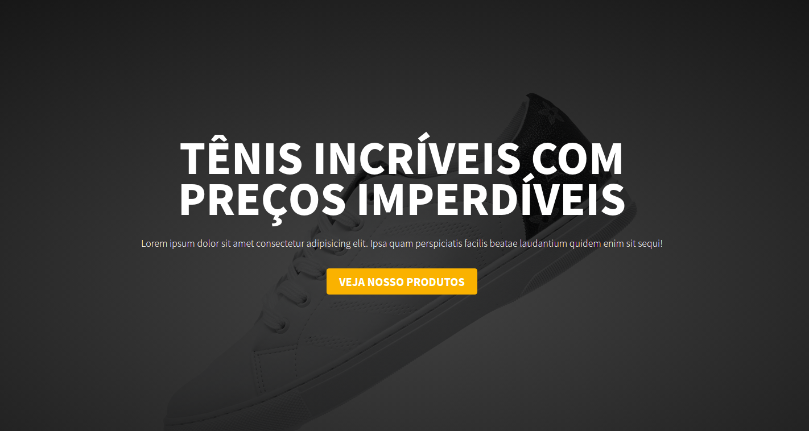
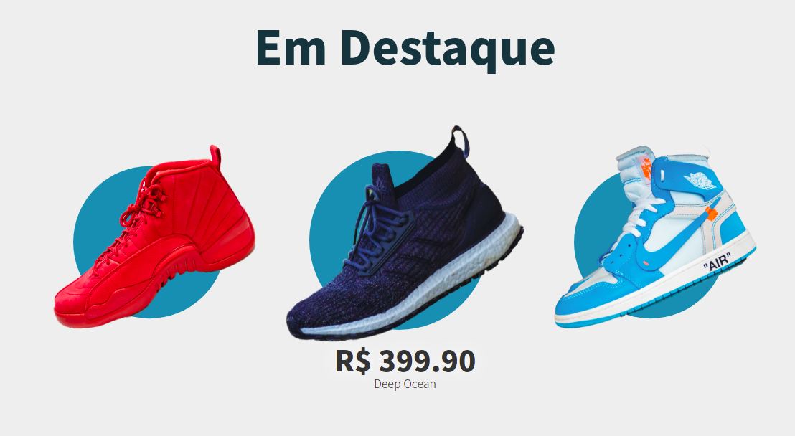
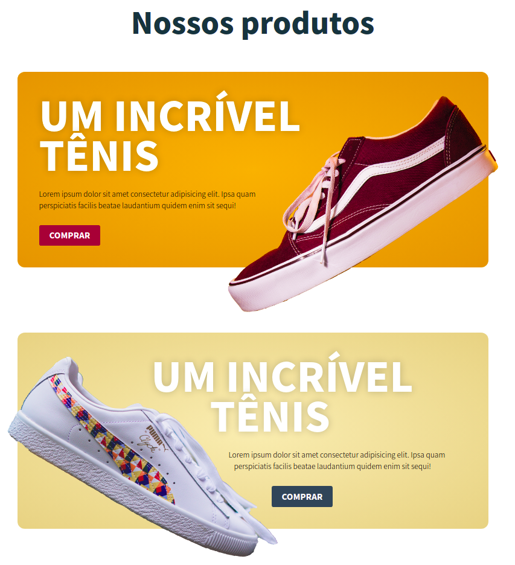

<h1 align="center">
  Landing Page - Tênis
</h1>

	
  

  
  
  
  
  

  <a href="#sobre">Sobre</a>&nbsp;&nbsp;&nbsp;|&nbsp;&nbsp;&nbsp;
  <a href="#tecnologias">Tecnologias</a>&nbsp;&nbsp;&nbsp;|&nbsp;&nbsp;&nbsp;
  <a href="#referências">Referências</a>&nbsp;&nbsp;&nbsp;|&nbsp;&nbsp;&nbsp;
  <a href="#licença">Licença</a>

# Sobre

Projeto desenvolvido apenas para estudo e aprender a criar landing pages mais modernas.

<h1 align="center">
  

  
  
  
</h1>

# Tecnologias

- HTML
- CSS
- SASS

# Referências

  https://www.youtube.com/watch?v=X1dz0xRbSJc&t=1s

## Licença

Esse projeto está sob a licença MIT. Veja o arquivo <a href="https://github.com/yuripalacio/landing-page-shoes/blob/master/LICENSE">LICENSE</a> para mais detalhes.

By [Yuri Palacio](https://www.linkedin.com/in/yuri-palacio/) :wave:
